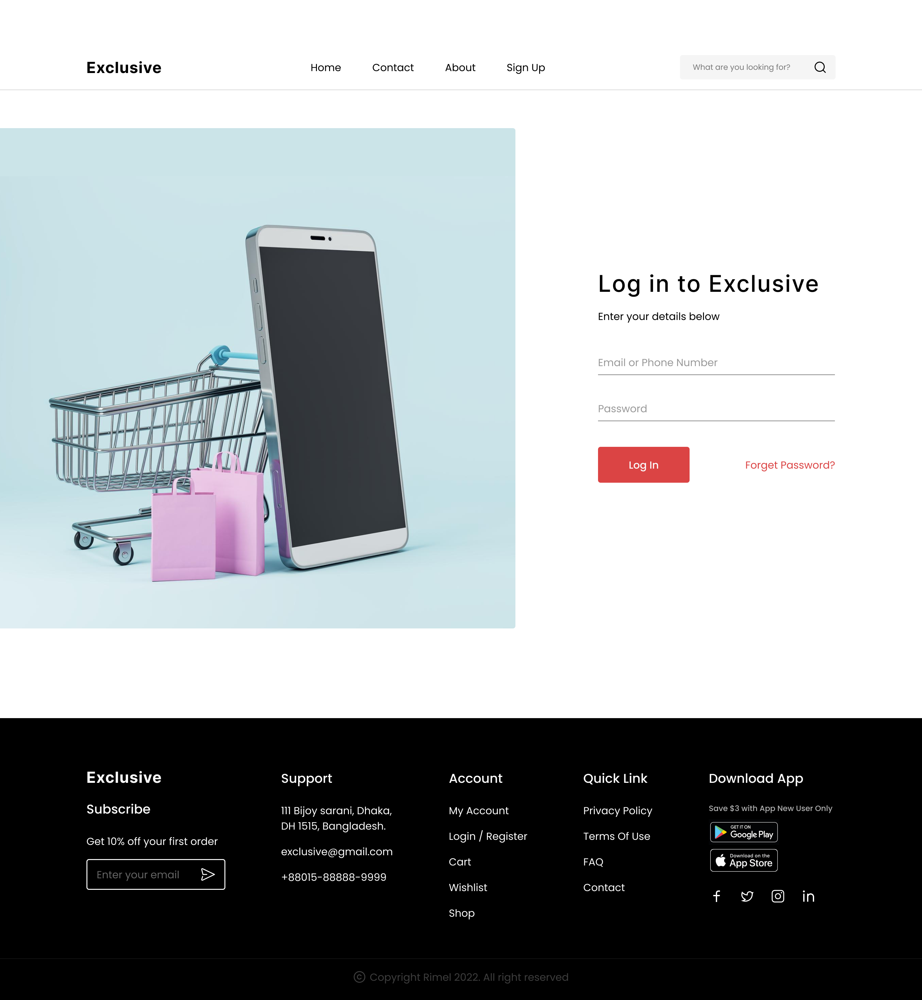
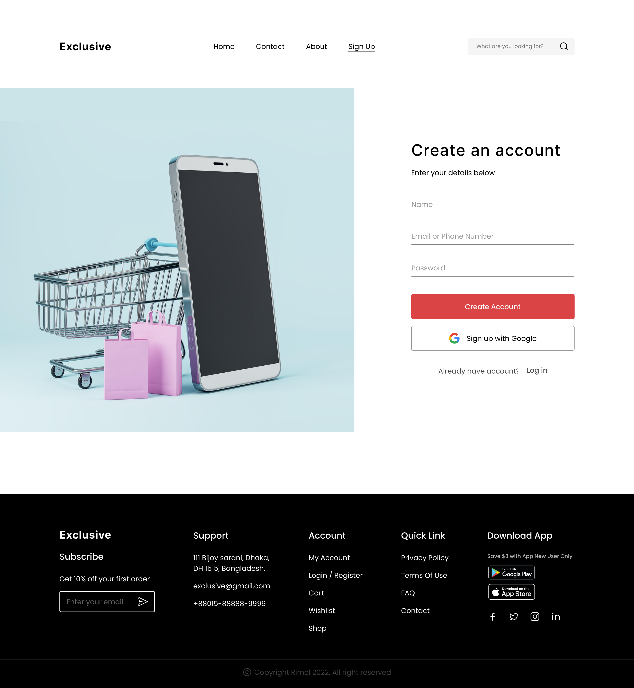
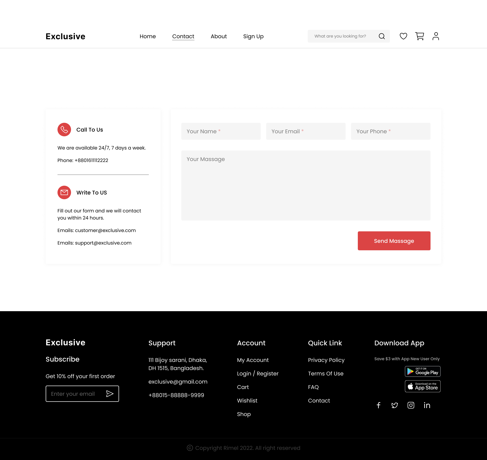
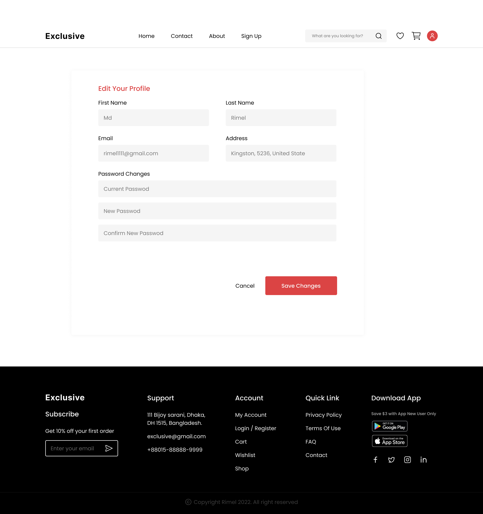

# Exclusive E-Commerce Website

A clean, multi-page e-commerce UI built with **HTML** and **CSS**. The goal is a simple, attractive interface that makes browsing and shopping feel smooth.

---

## Screenshots

<p align="center">
  
  
</p>
<p align="center">
  
</p>
<p align="center">
  
</p>
<p align="center">
  
  
</p>

> Available screenshots: `about.png`, `account.png`, `contact.png`, `home.png`, `login.png`, `sign_up.png`.  
> Keep any subset you like—just remove the corresponding `` tags above.

---

## Key Features

- **Home Page**: Highlights latest products and special offers.
- **Product Pages**: Dedicated pages for each product.
- **About Page**: Company story and team.
- **Contact Page**: Simple contact form.
- **User Authentication**
  - **Login**: Sign in to an existing account.
  - **Sign Up**: Create a new account.
- **Professional Footer**: Important links, social icons, and newsletter subscription.

---

## Tech Stack

- **HTML5** — Semantic structure  
- **CSS3** — Layout & visual styling  
- **Font Awesome** — Icon set

---
## 📂 Project Structure

**📁 E-commerce-Website-Project**

- **📁 css**
  - 🎨 about.css  
  - 🎨 constant.css  
  - 🎨 footer.css  
  - 🎨 contact.css  
  - 🎨 home.css  
  - 🎨 sign_up.css  

- **🖼️ images**
  - 🧩 (project images)

- **📁 html**
  - 📄 about.html  
  - 📄 account.html  
  - 📄 contact.html  
  - 📄 home.html  
  - 📄 index.html  
  - 📄 sign_up.html
---

## Getting Started

1) **Clone**
```bash
git clone https://github.com/HamodeMSGIX/E-commerce-Website-Project.git
cd E-commerce-Website-Project


